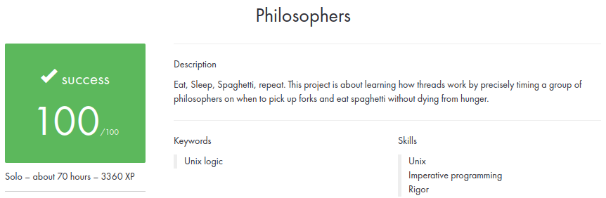

# Philosophers

### 💡 About the project

The objective of this project is to tackle the Dining Philosophers problem by implementing a multithreading solution.  
The Dining Philosophers problem is a classic synchronization challenge that exemplifies the complexities of concurrent programming.  

### 🛠️ Usage

Compile the project using the provided Makefile: ```make```  

Run an exemple: ```./philo 10 80 80 80 2```  

### 📋 Results


